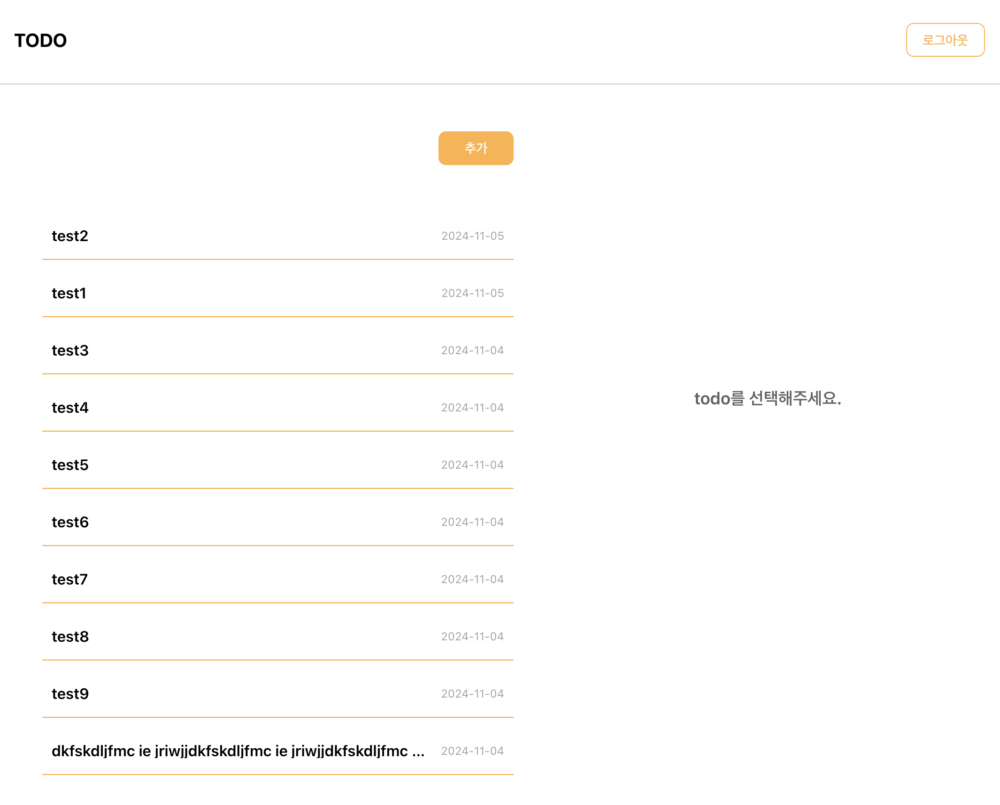

# Todo List Project

## 본인 소개

안녕하세요! 저는 1년 6개월 경력의 2년 차 프론트엔드 개발자입니다. 현재 이직을 준비 중이며, 이번 프로젝트에서는 React의 기본 내장 기능만을 사용해 Todo List를 구현해 보았습니다. 이를 통해 평소에 사용하던 여러 라이브러리의 편리함을 다시 한번 느끼게 되었습니다. 이번 기회를 통해 React의 핵심 개념과 기본 기능을 더욱 깊이 이해할 수 있었고, 코드의 일관성 및 가독성을 높이는 방법을 고민하며 개발하였습니다.

## 프로젝트 소개

이 프로젝트는 기본적인 Todo List 기능을 제공하는 웹 애플리케이션입니다. 사용자는 Todo를 추가, 수정, 삭제할 수 있으며, 각각의 Todo 항목을 상세하게 조회할 수 있습니다. 또한 로그인 및 회원가입 기능을 통해 사용자 인증이 가능합니다.

## 기술 스택

- **React**: 사용자 인터페이스를 구축하는 데 사용된 프론트엔드 라이브러리
- **React Router**: 페이지 간 이동과 URL 관리
- **Axios**: HTTP 요청을 관리하여 API와 통신
- **React Icons**: UI 구성에 필요한 아이콘 사용

## 프로젝트 요구 사항

### 1️⃣ Login / SignUp

<div style="display: flex; justify-content: center; align-items: center; gap: 10px; margin-bottom: 20px">
<div style="display: flex; flex-direction: column; justify-content: center; align-items: center; gap: 10px;">
<p>Login 페이지</p>

</div>
<div style="display: flex; flex-direction: column;justify-content: center; align-items: center; gap: 10px;">
<p>회원가입 페이지</p>

</div>
<div style="display: flex; flex-direction: column; justify-content: center; align-items: center; gap: 10px;">
<p>Logout</p>

</div>
</div>

- /auth 경로에 로그인 / 회원가입 기능을 개발합니다
  - 로그인, 회원가입을 별도의 경로로 분리해도 무방합니다
  - ✅ 최소한 이메일, 비밀번호 input, 제출 button을 갖도록 구성해주세요
- 이메일과 비밀번호의 유효성을 확인합니다
  - ✅ 이메일 조건 : 최소 `@`, `.` 포함
  - ✅ 비밀번호 조건 : 8자 이상 입력
  - ✅ 이메일과 비밀번호가 모두 입력되어 있고, 조건을 만족해야 제출 버튼이 활성화 되도록 해주세요
- 로그인 API를 호출하고, 올바른 응답을 받았을 때 루트 경로로 이동시켜주세요
  - ✅ 응답으로 받은 토큰은 로컬 스토리지에 저장해주세요
  - ✅ 다음 번에 로그인 시 토큰이 존재한다면 루트 경로로 리다이렉트 시켜주세요
  - ✅ 어떤 경우든 토큰이 유효하지 않다면 사용자에게 알리고 로그인 페이지로 리다이렉트 시켜주세요

### 2️⃣ Todo List

<div style="display: flex; justify-content: center; align-items: center; gap: 10px;">
<div style="display: flex; flex-direction: column; justify-content: center; align-items: center; gap: 5px;">
<p>todo main 페이지</p>

</div>
<div style="display: flex; flex-direction: column;justify-content: center; align-items: center; gap: 5px;">
<p>todo create 페이지</p>

</div>
</div>

<div style="display: flex; justify-content: center; align-items: center; gap: 10px; margin-top: 20px">
<div style="display: flex; flex-direction: column; justify-content: center; align-items: center; gap: 5px;">
<p>todo detail</p>

</div>
<div style="display: flex; flex-direction: column;justify-content: center; align-items: center; gap: 5px;">
<p>todo delete</p>

</div>
</div>

<div style="display: flex; justify-content: center; align-items: center; gap: 10px; margin-top: 20px">
<div style="display: flex; flex-direction: column; justify-content: center; align-items: center; gap: 5px;">
<p>todo edit</p>

</div>
</div>

- Todo List API를 호출하여 Todo List CRUD 기능을 구현해주세요

  - ✅ 목록 / 상세 영역으로 나누어 구현해주세요
  - ✅ Todo 목록을 볼 수 있습니다.
  - ✅ Todo 추가 버튼을 클릭하면 할 일이 추가 됩니다.
  - ✅ Todo 수정 버튼을 클릭하면 수정 모드를 활성화하고, 수정 내용을 제출하거나 취소할 수 있습니다.
  - ✅ Todo 삭제 버튼을 클릭하면 해당 Todo를 삭제할 수 있습니다.

- 한 화면 내에서 Todo List와 개별 Todo의 상세를 확인할 수 있도록 해주세요.

  - ✅ 새로고침을 했을 때 현재 상태가 유지되어야 합니다.
  - ✅ 개별 Todo를 조회 순서에 따라 페이지 뒤로가기를 통하여 조회할 수 있도록 해주세요.

- 한 페이지 내에서 새로고침 없이 데이터가 정합성을 갖추도록 구현해주세요.

  - ✅ 수정되는 Todo의 내용이 목록에서도 실시간으로 반영되어야 합니다

## 프로젝트 설정 및 실행

1. 패키지 설치: 다음 명령어로 필요한 패키지를 설치합니다.

```bash
npm install
```

2. 서버 실행: 개발 서버를 실행하여 프로젝트를 로컬에서 확인할 수 있습니다.

```bash
npm run start
```

API 설정: src/api/axiosInstance.ts 파일에서 기본 API URL을 설정할 수 있습니다.

## 폴더 구조

```bash
src
├── api              # API 요청 파일
│   ├── authApi.ts   # 인증 관련 API
│   ├── axiosInstance.ts # Axios 인스턴스 설정
│   └── todoApi.ts   # Todo 관련 API
├── components       # 공통 및 각 기능별 컴포넌트
│   ├── auth         # 인증 관련 컴포넌트
│   ├── common       # 공통 컴포넌트 (버튼, 인풋 등)
│   ├── layout       # 레이아웃 컴포넌트
│   └── todo         # Todo 기능 컴포넌트
│       ├── TodoDetailSection  # Todo 상세 정보 섹션
│       ├── TodoEditSection    # Todo 수정 섹션
│       ├── TodoForm           # Todo 입력 폼
│       └── TodoListSection    # Todo 목록 섹션
├── pages            # 각 페이지 컴포넌트
│   ├── CreateTodoPage # Todo 생성 페이지
│   ├── LoginPage    # 로그인 페이지
│   ├── SignupPage   # 회원가입 페이지
│   └── TodoPage     # Todo 메인 페이지
├── types            # TypeScript 타입 정의
└── utils            # 유틸리티 함수

```

## 코드 설계

- 컴포넌트 분리: 코드의 일관성, 가독성, 유지보수를 고려하여 기능별 컴포넌트를 분리하였습니다.
- 상태 관리: React의 useState 및 useEffect를 사용하여 상태를 관리하고, 필요한 데이터는 API로부터 불러옵니다.
- 함수 분리: API 요청은 api 폴더에 별도의 파일로 분리하여 재사용성을 높이고, 컴포넌트 로직과 분리하였습니다.
